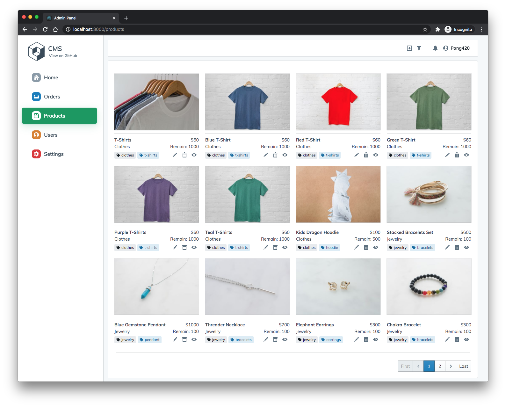

## FullStack

A project for learning fullstack develop

## Goal

- **Backend:** NestJS + Fastify + MongoDB **[WIP]**
  - [x] auth
  - [x] users
  - [x] settings
  - [x] products
  - [ ] orders
- **Admin Panel**: Create-React-App + Blueprintjs **[WIP]** [Preview](https://pong-fullstack.herokuapp.com/)
  
  
  
- **Frontend**: NextJS
- **Apps**: React Native

## Development

Start local mongodb `mongodb://localhost:27017/` <br />
or create a `.env` / `.env.local` file under `packages/server` and add

```
MONGODB_URI=mongodb://YOUR_MONGODB_URL
```

then

```
yarn dev
```

### image upload

Currently, images are upload to [Cloudinary](https://cloudinary.com/), <br />
If you are heroku user, you may enable [Cloudinary Add-ons](https://elements.heroku.com/addons/cloudinary). <br />
create a `.env.local` file under `packages/server` and add

```
CLOUDINARY_URL = cloudinary://<api_key>:<api_secret>@<cloud_name>
```

create a `.env.local` file under `packages/admin` and add

```
REACT_APP_CLOUDINARY_CLOUD_NAME = <cloud_name>
REACT_APP_CLOUDINARY_API_KEY = <api_key>
```
