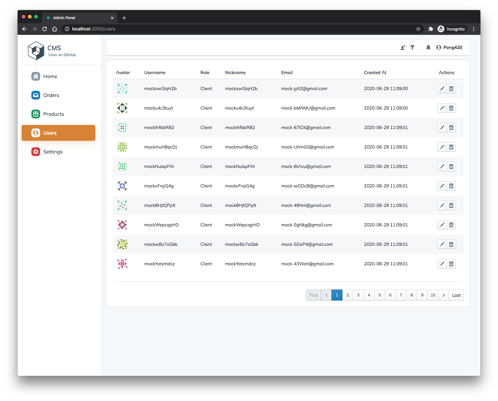

## FullStack

A project for learning fullstack develop

## Goal

- **Backend:** NestJS + Fastify + MongoDB **[WIP]**
  - [x] auth
  - [x] users
  - [x] settings
  - [x] products
  - [ ] orders
- **Admin Panel**: Create-React-App + Blueprintjs **[WIP]** [[Preview](https://pong-fullstack.herokuapp.com/guest-registration)]
  
  
  
- **Frontend**: NextJS
- **Apps**: React Native
