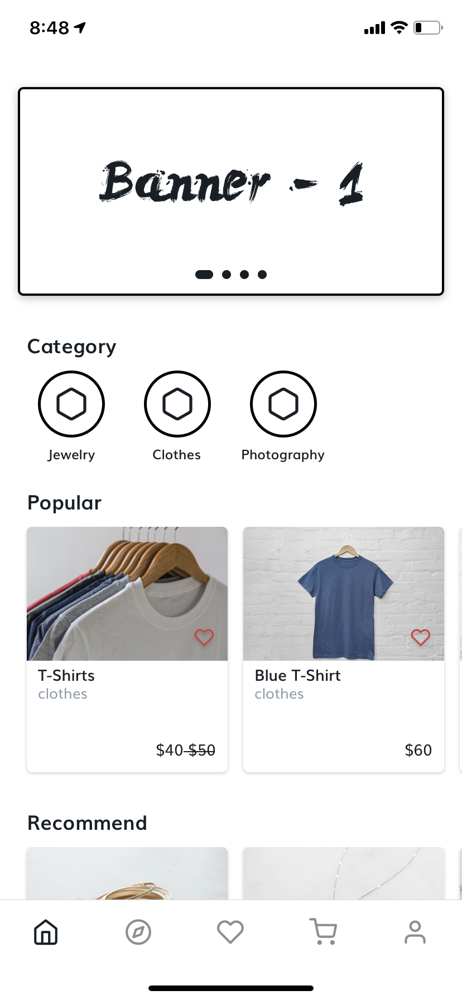

## @fullstack/app

### Open in expo

|                Anroid                 |                iOS                |
| :-----------------------------------: | :-------------------------------: |
|  |  |

### Screenshot

|                                                             |                                                                         |                                                                 |
| :---------------------------------------------------------: | :---------------------------------------------------------------------: | :-------------------------------------------------------------: |
|                            Home                             |                                Discover                                 |                            Favourite                            |
|  |          |  |
|                            User                             |                            Delivery Address                             |                                                                 |
|  |  |                                                                 |

### Notes

- Using `PageModal` instead of `Modal` in `react-native` because `Toast` component cannot overlay on it
